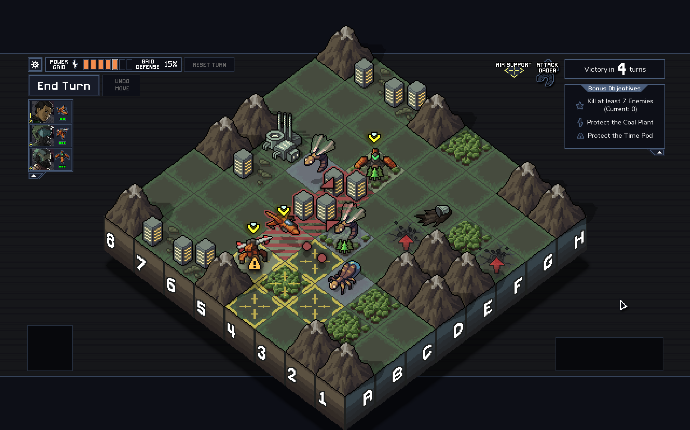
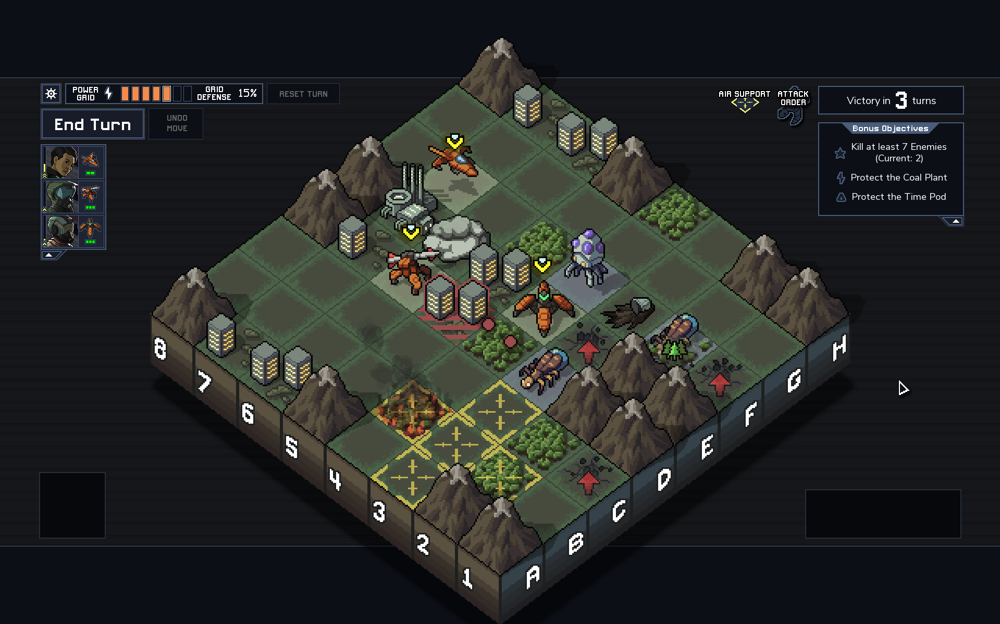

# ItBN: Into the Breach Notation

## A guide to textually notating moves in Into the Breach

### Table of Contents
1. [Preface](#preface)
2. [Basic rules](#basic-rules)
3. [Extended rules](#extended-rules)
4. [Full turn example](#full-turn-example)

### Preface

As per update 1.0.16, ITB has a native grid overlay ("Grid Coordinates" in the options) so those coordinates are what's used here. Text notation should ideally exist alongside a screenshot to explain what is happening, and any pilot-specific abilities used should be noted preceding the notation itself. I've based this on algebraic chess notation. Hopefully it's specific enough to show your intended actions & consequences without having to get bogged down in what weapons or upgrades you have equipped.

### Basic rules

- A unit is designated by the tile it starts the turn in.
- **Unit movement** is designated by an **initial tile** and an **ending tile** with a **hyphen** inbetween.
  - Example: `A2-B3` (The unit that's in *A2* moves to *B3*.)
- **Unit abilities** are designated by an **initial tile** and a **target tile** with an **x** inbetween. Projectile and artillery weapons need no differentiation.
  - Melee example: `C5xD5` (The unit in *C5* attacks tile *D5*.)
  - Projectile example: `C5xE5` (The unit in *C5* attacks tile *E5* with a projectile.)
  - Artillery example: `C5xC1` (The unit in *C5* attacks tile *C1* with artillery.)
- Each action should be listed in the order committed on **new lines**, or for brevity, with a semicolon between.
  - Example:
  
      ```
      A3-C3
      C3xC4
          1xC4
      ```
  - Or: `A3-C3; C3xC4`
- **Results** of an action are listed under the action on **indented new lines**, or for brevity, in parentheses after the action with semicolons between each result.
  - Note that damages and status effects should be put *before* any pushes or other movement results.
- **Damage** is indicated as the **amount of damage** and the **tile it is applied to** with an **x** inbetween.
- **Deaths** are indicated as the **tile of the unit that dies** with an **x** preceding it. They are a result of damage.
- A **push** is indicated simply as a move. Pushed tiles that have no unit are omitted. If a push results in a collision ("bump") or environmental death, put the results of that collision in a nested indent or set of parentheses.
- A **bump** is assumed to move neither of the affected units.
- An **environmental death** is designated by the tile it's located on, not the inital tile of the unit that was pushed onto it. Notate this as **Envx** and the aforementioned tile.
    - Example (semicolons for readability): My Artillery Mech in *C5* attacks *C3*, which does 1 damage to *C3*; pushes *B3* to *A3*; pushes *C2* (a non-flying unit) to *C1* (a water space), killing it; and pushes *D3* to *E3* (which contains a unit already), dealing 1 bump damage to both.

      ```
      C5xC3
        1xC3
          B3-A3
          C2-C1
              EnvxC1
          D3-E3
              1xD3
              1xE3
      ```
    - Or: `C5xC3 (1xC3; B3-A3; C2-C1 (xC1); D3-E3 (1xD3; 1xE3))`
- **Grid damage** is appended to damage to a structure as **xGr**. If you wish to notate a game over, for some reason, put `xGr` on a new line.
- Boulders, mountains, dams, ice tiles, and so on are considered units with their respective amount of health. Ice tiles' destruction is not shown as a death, rather as an application of water as the result of damage (see "Status effects" below).
- Note that combat progresses as *Enemy movement* > *Player movement & actions* > *Status/Environmental effects* > *Enemy actions*. Therefore, notation is assumed to start during "Player movement & actions", and if you wish to notate any other states, put three hyphens on a new line (with the phase name in the middle if you want), or use a single pipe (`|`).
  - Example: I move my unit in *C3* to *C4* and end my turn. An enemy in *G2* is killed by a satellite launch. An enemy in *G7* attacks a structure in *F7*, dealing 1 damage to the structure and my Grid. Then, the enemy in *G7* moves to *F5*. Then it's my turn again.

      ```
      C3-C4
      ---
      xG2
      ---
      G7xF7
          1xF7xGr
      ---
      G7-F5
      ---
      ```
    
    

### Extended rules

#### Teleports and abilities that move a unit

- Any teleport, dash, or other moving ability is notated just like a push, and is the **result** of an ability.
  - Dash Punch example: A unit in *E8* dash punches a unit in *E4*, dealing one damage and pushing it a tile.

      ```
      E8xE4
          E8-E5
          1xE4
          E4-E3
      ```
  - Aerial Bombs example: A unit in *D4* flies over *E4* and *F4*, applying 1 damage and Smoke to both, and lands in *G4*.

      ```
      D4xG4
          1xE4
          Sm-E4
          1xF4
          Sm-F4
          D4-G4
      ```
- Vice Grip is essentially a teleport ability.
- As for the "Teleporter" weapon that swaps two units, just take two equal and adjacent moves to mean a swap.
  - Teleporter example: A unit in *A3* swaps with a unit in *C3*.

      ```
      A3xC3
          A3-C3
          C3-A3
      ```

#### Shields

- The application of a shield is notated as **Sh** and the **tile it is applied to** with a **hyphen** inbetween.
  - Example: `Sh-C3` (My unit in tile *C3* receives a shield.)
- The destruction of a shield is notated as **Sh** and the **tile of the unit whose shield is destroyed** with an **x** inbetween.
  - Example: `ShxC3` (My unit in tile *C3* loses a shield.)

#### Status effects

- The application of status effects is notated as **Fi** for Fire, **Ic** for Ice, **Ac** for A.C.I.D., **Sm** for Smoke, and **Wa** for Water (in the case that an ice tile is destroyed), with the **tile it is applied to** and a **hyphen** inbetween.
- Examples:
  - `Fi-F8` (The unit in *F8* is set on fire and/or the tile is set on fire.)
  - `Ic-F8` (The unit in *F8* is frozen.)
  - `Ac-F8` (The unit in *F8* is covered in A.C.I.D., or the tile has A.C.I.D. applied. I don't know if that can actually happen but let's roll with it.)
  - `Sm-F8` (Tile *F8* is now covered in smoke.)
  - `Wa-F8` (Tile *F8* is now a water tile. This should only be the result of damage applied to a tile.)
- **Fire damage** resolves in the "Status/environmental effects" section, and is prepended with **Fi-**.
  - Example: `Fi-1xF8` (The unit in *F8* takes 1 fire damage.)
  - The same holds true for other damaging status effects, such as the "Storm Generator" passive effect which is shown as `Sm-1xF8`.

#### Repairs and healing

- Repairs are notated just like damage, but with a **+** instead of an **x**.
- Example: `1+E5` (A unit in E5 repairs itself.)

#### Vek Emergence

- An emergence point should simply be shown as **Em-** and the **tile it is on**.
- If a unit is on that tile, show that it takes 1 damage and assume that the unit below does not emerge.
  - Example: `Em-F2` (An enemy emerges from tile *F2*.)
  - Example: An enemy is emerging from tile *A7*. There is a unit standing on that tile, and takes 1 damage, killing the standing unit.

      ```
      Em-A7
          1xA7
              xA7
      ```

#### Attack cancels, flips, and misc. abilities

- An attack that's **canceled** (space is covered in smoke, unit is moved and target no longer exists, etc.) doesn't have to be notated. But, if you want to specifically show it, you can use **Ca** and **tile of unit canceled** with an **x** inbetween.
- An enemy attack that's **flipped** can be notated with, you guessed it, **Fl** and the **tile of the unit flipped** with an **x** inbetween.
- **Targeted abilities** (which can hit any space on the map) require no different notation from a regular ranged attack, just the **tile they target**.
- **Untargeted abilities**, when they need to be notated, can simply be the **tile of the unit using the ability** and an **x** - nothing else. Just list the effects as results like normal.
  - Missile Barrage example: A unit in *H4* uses Missile Barrage, hitting enemies in *A4*, *B8*, and *H2* for 1 damage, and killing the enemy in *H2*.
 
      ```
      H4x
          1xA4
          1xB8
          1xH2
              xH2
      ```
- If you pick up a pod... just say `Pod`.
      
----

### Full turn example

Context: I'm using the Rusting Hulks, as you can see from the screenshot. Chen Rong is in the Jet Mech. Her ability allows 1 tile of movement after attacking.



```
F5-E4
E4xD4
    D4-C4
C5-D6
D6xF6
    1xE6
    SmxE6
    CaxE6
F6-F7
B5-D6
-Environment- 
Sm-1xE6
    xE6
EnvxC4
-Enemy actions-
C3xC8
Em-E3
Em-F1
-Enemy movement-
C3-D3
E3-F4
F1-F2
```



---

Thanks for reading. Let me know if I missed anything. When I get around to it, I'll attempt a guide to visual notation as well, an example of which I show [here](https://twitter.com/fontiago/status/971099989496745989).

–Eden
