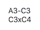

# Into the Breach Notation

## A guide to textually and visually notating moves in Into the Breach

### Text

As per update 1.0.16, ITB has a native grid overlay ("Grid Coordinates" in the options) so those coordinates are what's used here. Text notation should ideally exist alongside a screenshot to explain what is happening, and any pilot-specific abilities used should be noted preceding the notation itself. I've based this on algebraic chess notation.

#### Basic rules

- Your unit is designated by the cell it starts the turn in.
- Unit **movement** is designated by an **initial cell** and an **ending cell** with a **hyphen** between.
  - Example: A2-B3 (I move my unit that's in *A2* to *B3*.)
- Unit abilities are designated by an **initial cell** and a **target cell** with an **x** between. Projectile and artillery weapons need no differentiation.
  - Melee example: C5xD5 (My unit in *C5* attacks cell *D5*.)
  - Projectile example: C5xE5 (My unit in *C5* attacks cell *E5* with a projectile.)
  - Artillery example: C5xC1 (My unit in *C5* attacks cell *C1* with artillery.)
- Each action should be listed in the order committed on **new lines**, or for brevity, with a semicolon between.
  - Example:
  - 
  - Or: `A3-C3; C3xC4`
- *Results* of an action are listed under the action on **indented new lines**, or for brevity, in **parentheses** after the action with semicolons between each result.
